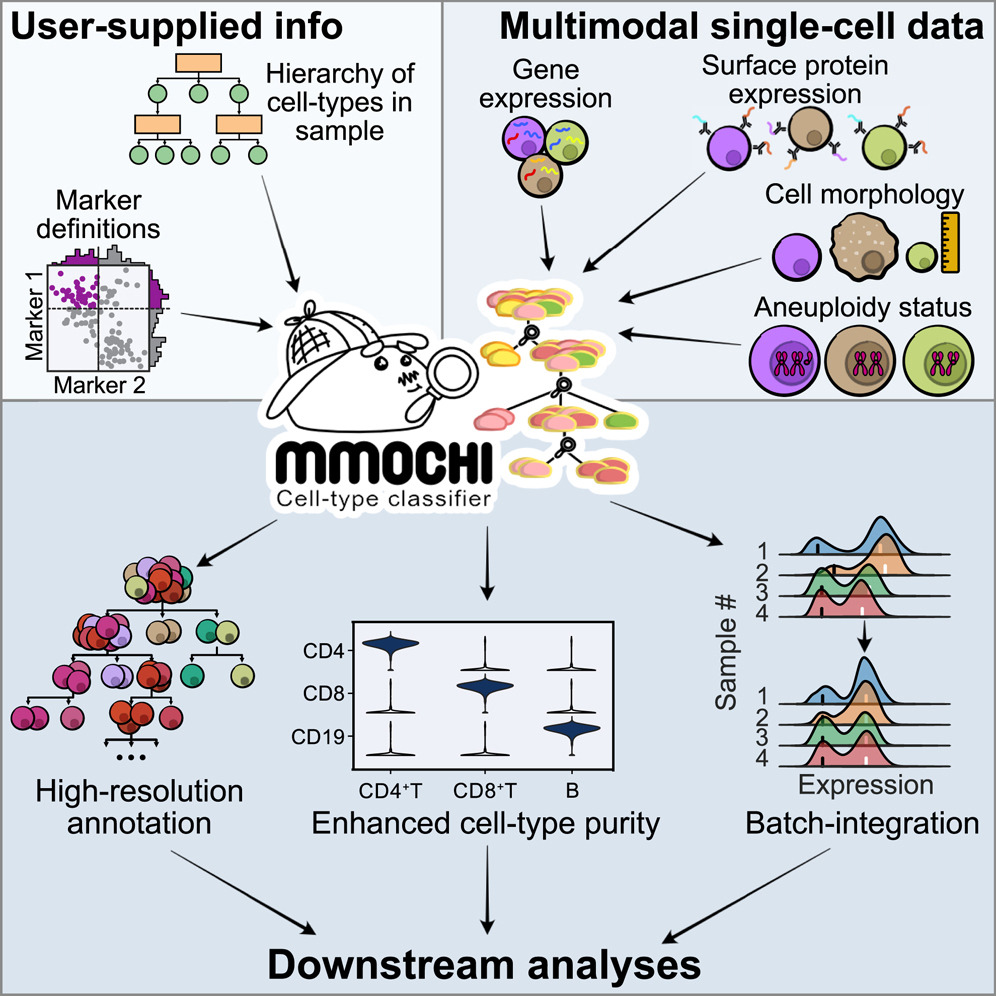

MMoCHi - MultiModal Classifier Hierarchy
********************************************

.. mdinclude:: ../README.md
   :start-line: 5
   :end-line: 13

* To get started with MMoCHi, see :ref:`installation`, :ref:`tutorials`, and :ref:`Example Hierarchies`.
* For more details on formatting your data correctly, read the :ref:`Input and Output Specifications`.
* For complete documentation, check out our :ref:`api`.
* Check out our `Github <https://github.com/donnafarberlab/MMoCHi>`_! 

Details about the algorithm, example applications, and benchmarking is available in our paper:
Daniel P. Caron, William L. Specht, David Chen, Steven B. Wells, Peter A. Szabo, Isaac J. Jensen, Donna L. Farber, Peter A. Sims. "**Multimodal hierarchical classification of CITE-seq data delineates immune cell states across lineages and tissues**." Cell Reports Methods, 2025 `[Open Access] <https://doi.org/10.1016/j.crmeth.2024.100938>`_

.. tocTree::
   :hidden:
   :maxdepth: 1

   installation
   Input_Output_Specs
   CHANGELOG
   tutorials
   Example_Hierarchies
   Landmark_Registration_Advice
   api
   GitHub <https://github.com/donnafarberlab/MMoCHi>
